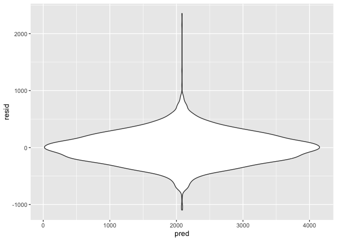
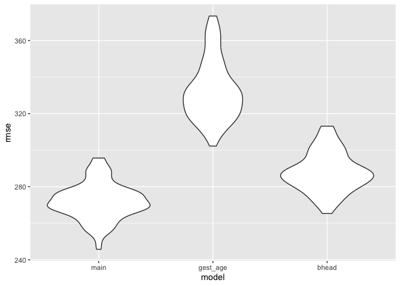

p8105_hw6_dcm2192
================
Dylan Morgan
2024-12-02

Load packages.

``` r
library(tidyverse)
library(modelr)
library(mgcv)
```

## Problem 2

Load data.

``` r
homicide_data <- read_csv("./data/homicide-data.csv")
```

    ## Rows: 52179 Columns: 12
    ## ── Column specification ────────────────────────────────────────────────────────
    ## Delimiter: ","
    ## chr (9): uid, victim_last, victim_first, victim_race, victim_age, victim_sex...
    ## dbl (3): reported_date, lat, lon
    ## 
    ## ℹ Use `spec()` to retrieve the full column specification for this data.
    ## ℹ Specify the column types or set `show_col_types = FALSE` to quiet this message.

Create city_state variable and homicide solved binary variable. Remove
cities with missing or inaccurate data. Limit victim_race data to black
or white, and make victim_age numeric.

``` r
homicide_data <-
  homicide_data |>
  mutate(
    city_state = str_c(city, ", ", state), 
    solved = as.numeric(disposition == "Closed by arrest"), 
    victim_age = as.numeric(victim_age)
  ) |> 
  filter(!(city_state %in% c("Dallas, TX", "Phoenix, AZ", "Kansas City, MO", "Tulsa, AL")), 
         victim_race %in% c("White", "Black")
         )
```

    ## Warning: There was 1 warning in `mutate()`.
    ## ℹ In argument: `victim_age = as.numeric(victim_age)`.
    ## Caused by warning:
    ## ! NAs introduced by coercion

For the city of Baltimore, MD, use the glm function to fit a logistic
regression with resolved vs unresolved as the outcome and victim age,
sex and race as predictors. Save the output of glm as an R object; apply
the broom::tidy to this object; and obtain the estimate and confidence
interval of the adjusted odds ratio for solving homicides comparing male
victims to female victims keeping all other variables fixed.

Create Baltimore dataset.

``` r
baltimore_homicide_data <- 
  homicide_data |> 
  filter(city_state == "Baltimore, MD")
```

Fit logistic regression to Baltimore homicide data. Present estimate and
CI of OR for solving homicides comparing male victims to female victims,
with all other variables fixed.

``` r
baltimore_fit_log <- 
  baltimore_homicide_data |> 
  glm(solved ~ victim_age + victim_sex + victim_race, data = _, family = binomial())

baltimore_fit_log |>
  broom::tidy() |>
  mutate(OR = exp(estimate), 
         CI_lower = confint(baltimore_fit_log)[,1], 
         CI_upper = confint(baltimore_fit_log)[,2]) |>
  select(term, log_OR = estimate, OR, CI_lower, CI_upper, p.value) |>
  knitr::kable(digits = 3)
```

    ## Waiting for profiling to be done...
    ## Waiting for profiling to be done...

| term             | log_OR |    OR | CI_lower | CI_upper | p.value |
|:-----------------|-------:|------:|---------:|---------:|--------:|
| (Intercept)      |  0.310 | 1.363 |   -0.025 |    0.648 |   0.070 |
| victim_age       | -0.007 | 0.993 |   -0.013 |    0.000 |   0.043 |
| victim_sexMale   | -0.854 | 0.426 |   -1.126 |   -0.584 |   0.000 |
| victim_raceWhite |  0.842 | 2.320 |    0.501 |    1.187 |   0.000 |

Run models for each city.

``` r
nest_glm_cities_results <- 
  homicide_data |> 
  nest(data = -city_state) |> 
  mutate(
    models = map(data, \(df) glm(solved ~ victim_age + victim_sex + victim_race, data = df)), 
    results = map(models, broom::tidy)) |> 
  unnest(results)

confint(glm(solved ~ victim_age + victim_sex + victim_race, data = homicide_data))
```

    ## Waiting for profiling to be done...

    ##                           2.5 %        97.5 %
    ## (Intercept)        0.5683915174  0.6029774853
    ## victim_age        -0.0008696876 -0.0001740991
    ## victim_sexMale    -0.1367001729 -0.1087619971
    ## victim_sexUnknown -0.1684876527  0.1353358327
    ## victim_raceWhite   0.1335316604  0.1613757037

``` r
nest_glm_cities_results |> 
  select(city_state, term, estimate) |> 
  mutate(term = fct_inorder(term)) |> 
  pivot_wider(
    names_from = term, values_from = estimate) |> 
  knitr::kable(digits = 3)
```

| city_state         | (Intercept) | victim_age | victim_sexMale | victim_sexUnknown | victim_raceWhite |
|:-------------------|------------:|-----------:|---------------:|------------------:|-----------------:|
| Albuquerque, NM    |       0.642 |     -0.004 |          0.130 |            -0.506 |            0.090 |
| Atlanta, GA        |       0.709 |     -0.003 |          0.001 |                NA |            0.062 |
| Baltimore, MD      |       0.570 |     -0.001 |         -0.204 |                NA |            0.199 |
| Baton Rouge, LA    |       0.761 |     -0.002 |         -0.220 |                NA |            0.101 |
| Birmingham, AL     |       0.667 |     -0.002 |         -0.034 |                NA |           -0.017 |
| Boston, MA         |       0.514 |     -0.001 |         -0.079 |            -0.276 |            0.472 |
| Buffalo, NY        |       0.381 |      0.003 |         -0.152 |                NA |            0.228 |
| Charlotte, NC      |       0.743 |      0.000 |         -0.023 |                NA |            0.083 |
| Chicago, IL        |       0.391 |      0.001 |         -0.196 |                NA |            0.125 |
| Cincinnati, OH     |       0.763 |     -0.002 |         -0.192 |                NA |            0.238 |
| Columbus, OH       |       0.539 |      0.002 |         -0.155 |                NA |            0.040 |
| Denver, CO         |       0.665 |     -0.003 |         -0.177 |                NA |            0.138 |
| Detroit, MI        |       0.491 |      0.001 |         -0.133 |                NA |            0.104 |
| Durham, NC         |       0.717 |     -0.001 |         -0.046 |                NA |           -0.005 |
| Fort Worth, TX     |       0.789 |     -0.005 |         -0.094 |                NA |            0.014 |
| Fresno, CA         |       0.493 |      0.002 |          0.061 |                NA |            0.155 |
| Houston, TX        |       0.650 |     -0.002 |         -0.084 |                NA |            0.015 |
| Indianapolis, IN   |       0.591 |     -0.002 |         -0.020 |                NA |            0.169 |
| Jacksonville, FL   |       0.576 |     -0.002 |         -0.081 |                NA |            0.108 |
| Las Vegas, NV      |       0.685 |     -0.002 |         -0.041 |                NA |            0.059 |
| Long Beach, CA     |       0.736 |      0.002 |         -0.177 |                NA |           -0.008 |
| Los Angeles, CA    |       0.592 |     -0.001 |         -0.100 |                NA |            0.133 |
| Louisville, KY     |       0.677 |     -0.002 |         -0.157 |                NA |            0.212 |
| Memphis, TN        |       0.847 |     -0.003 |         -0.064 |                NA |            0.046 |
| Miami, FL          |       0.457 |      0.000 |         -0.157 |                NA |            0.125 |
| Milwaukee, wI      |       0.761 |     -0.003 |         -0.071 |                NA |            0.115 |
| Minneapolis, MN    |       0.446 |      0.001 |         -0.013 |                NA |            0.122 |
| Nashville, TN      |       0.642 |     -0.001 |          0.008 |                NA |            0.032 |
| New Orleans, LA    |       0.592 |     -0.005 |         -0.126 |                NA |            0.186 |
| New York, NY       |       0.714 |      0.002 |         -0.270 |                NA |            0.163 |
| Oakland, CA        |       0.522 |      0.000 |         -0.134 |                NA |            0.369 |
| Oklahoma City, OK  |       0.564 |     -0.002 |         -0.006 |                NA |            0.089 |
| Omaha, NE          |       0.549 |      0.001 |         -0.174 |                NA |            0.401 |
| Philadelphia, PA   |       0.680 |      0.000 |         -0.161 |                NA |            0.101 |
| Pittsburgh, PA     |       0.561 |      0.001 |         -0.194 |             0.439 |            0.288 |
| Richmond, VA       |       0.805 |     -0.003 |          0.003 |                NA |            0.127 |
| San Antonio, TX    |       0.752 |     -0.003 |         -0.081 |                NA |            0.069 |
| Sacramento, CA     |       0.632 |      0.002 |         -0.087 |            -0.669 |            0.060 |
| Savannah, GA       |       0.515 |      0.000 |         -0.035 |                NA |            0.130 |
| San Bernardino, CA |       0.365 |      0.005 |         -0.167 |                NA |            0.003 |
| San Diego, CA      |       0.751 |     -0.001 |         -0.174 |                NA |            0.157 |
| San Francisco, CA  |       0.330 |      0.006 |         -0.105 |                NA |            0.200 |
| St. Louis, MO      |       0.560 |     -0.001 |         -0.087 |                NA |            0.136 |
| Stockton, CA       |       0.350 |      0.000 |          0.072 |                NA |            0.197 |
| Tampa, FL          |       0.615 |      0.000 |         -0.052 |                NA |           -0.052 |
| Tulsa, OK          |       0.691 |     -0.002 |         -0.005 |                NA |            0.113 |
| Washington, DC     |       0.690 |     -0.002 |         -0.089 |            -0.030 |            0.153 |

## Problem 3

Load dataset.

``` r
birthweight <- read_csv("./data/birthweight.csv")
```

    ## Rows: 4342 Columns: 20
    ## ── Column specification ────────────────────────────────────────────────────────
    ## Delimiter: ","
    ## dbl (20): babysex, bhead, blength, bwt, delwt, fincome, frace, gaweeks, malf...
    ## 
    ## ℹ Use `spec()` to retrieve the full column specification for this data.
    ## ℹ Specify the column types or set `show_col_types = FALSE` to quiet this message.

``` r
birthweight <- 
  birthweight |> 
  mutate(babysex = as.factor(babysex), 
         frace = as.factor(frace), 
         malform = as.factor(malform), 
         mrace = as.factor(mrace)) |> 
  select(-c(pnumlbw, pnumsga))
```

Propose regression model.

``` r
bwt_fit_log <- 
  birthweight |> 
  glm(bwt~., data = _)

best_mod_proposal <- MASS::stepAIC(bwt_fit_log, trace=FALSE)

best_mod_proposal |>
  broom::tidy() |>
  mutate(OR = exp(estimate)) |>
  select(term, log_OR = estimate, OR, p.value) |>
  knitr::kable(digits = 3)
```

| term        |    log_OR |           OR | p.value |
|:------------|----------:|-------------:|--------:|
| (Intercept) | -6098.822 | 0.000000e+00 |   0.000 |
| babysex2    |    28.558 | 2.526907e+12 |   0.001 |
| bhead       |   130.777 | 6.248089e+56 |   0.000 |
| blength     |    74.947 | 3.540925e+32 |   0.000 |
| delwt       |     4.107 | 6.074800e+01 |   0.000 |
| fincome     |     0.318 | 1.374000e+00 |   0.069 |
| gaweeks     |    11.592 | 1.082812e+05 |   0.000 |
| mheight     |     6.594 | 7.307250e+02 |   0.000 |
| mrace2      |  -138.792 | 0.000000e+00 |   0.000 |
| mrace3      |   -74.887 | 0.000000e+00 |   0.077 |
| mrace4      |  -100.678 | 0.000000e+00 |   0.000 |
| parity      |    96.305 | 6.677239e+41 |   0.017 |
| ppwt        |    -2.676 | 6.900000e-02 |   0.000 |
| smoken      |    -4.843 | 8.000000e-03 |   0.000 |

``` r
birthweight |> 
  modelr::add_residuals(best_mod_proposal) |> 
  modelr::add_predictions(best_mod_proposal) |> 
  ggplot(aes(x = pred, y = resid)) + geom_violin()
```

<!-- -->

Using the `stepAIC` function learned from a previous class, I was able
to produce a reasonable model by allowing the `stepAIC` function to
remove the factors calculated to not be as significant as the factors
that remained in the model. The majority of the remaining variables had
p-values less than 0.05, making them statistically significant.

Compare with two other models.

``` r
bwt_fit_gest_age <- 
  birthweight |> 
  glm(bwt ~ blength + gaweeks, data = _)

bwt_fit_bhead <- 
  birthweight |> 
  glm(bwt ~ bhead + blength + babysex + 
        bhead*blength + 
        bhead*babysex + 
        blength*babysex + 
        bhead*blength*babysex, 
      data = _)
```

Cross-validation.

``` r
cv_df <- 
  crossv_mc(birthweight, 100) |> 
  mutate(
    train = map(train, as_tibble),
    test = map(test, as_tibble))

cv_df <- 
  cv_df |> 
  mutate(
    main_mod = map(train, \(df) glm(formula = bwt ~ babysex + bhead + blength + delwt + fincome + 
                                       gaweeks + mheight + mrace + parity + ppwt + smoken, data = df)),
    gest_age_mod = map(train, \(df) glm(bwt ~ blength + gaweeks, data = df)),
    bhead_mod = map(train, \(df) glm(bwt ~ bhead + blength + babysex + 
                                         bhead*blength + 
                                         bhead*babysex + 
                                         blength*babysex + 
                                         bhead*blength*babysex, data = df))) |> 
  mutate(
    rmse_main = map2_dbl(main_mod, test, \(mod, df) rmse(model = mod, data = df)),
    rmse_gest_age    = map2_dbl(gest_age_mod, test, \(mod, df) rmse(model = mod, data = df)),
    rmse_bhead = map2_dbl(bhead_mod, test, \(mod, df) rmse(model = mod, data = df)))
```

    ## Warning: There was 1 warning in `mutate()`.
    ## ℹ In argument: `rmse_main = map2_dbl(...)`.
    ## Caused by warning in `predict.lm()`:
    ## ! prediction from rank-deficient fit; attr(*, "non-estim") has doubtful cases

``` r
cv_df |> 
  select(starts_with("rmse")) |> 
  pivot_longer(
    everything(),
    names_to = "model", 
    values_to = "rmse",
    names_prefix = "rmse_") |> 
  mutate(model = fct_inorder(model)) |> 
  ggplot(aes(x = model, y = rmse)) + geom_violin()
```

<!-- -->
